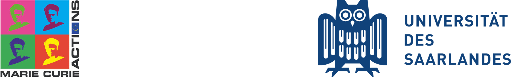

# 😊 About Us

## Project Origins

This project began during my Ph.D. studies at [Jochen Hub's Computational Biophysics Group](https://biophys.uni-saarland.de/) at [Saarland University](https://www.uni-saarland.de/en/home.html). It was carried out within the framework of the ITN (Innovative Training Network) [PROTON](https://cordis.europa.eu/project/id/860592). If you are interested in getting in touch or learning more about my work, please visit my [Portfolio](https://alejandro.netlify.app).

```{important}
   This project received funding from [Marie Skłodowska-Curie Actions](https://cordis.europa.eu/project/id/860592).
```

[](https://www.uni-saarland.de/en/home.html)